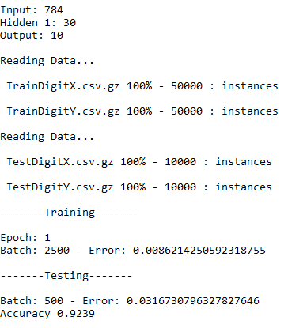

# Multilayer Perceptron

### Overview
An implementation of a multilayer perceptron with numpy. It includes the MNIST Training and Testing files, as well as a file to write the networks predictions to. 
The network trains on 50 000 examples of handwritten digits and is tested on 10 000 examples to get the networks accuracy. By default the network has 784 inputs, 30 hidden neurons and 10 outputs. The learning rate is set to 3, and mini batch size is 20. It should look something like this when running.



To change the networks learning rate, batch size and number of epochs you can edit the values at the bottom of the neural_network.py files under the network parameters comment. 

```python
if __name__ == '__main__':

    # network Parameters
    epochs = 20
    batchsize = 20
    learningrate = 3
    n_input = int(sys.argv[1])
    n_hidden_1 = int(sys.argv[2])
    n_hidden_2 = 30
    n_output = int(sys.argv[3])
    layers = [n_input, n_hidden_1, n_output]
```

In order to increase the network capacity, you can change the networks number of hidden neurons when running the program with the command line argument at index 2.

### Dependencies
You will need to be using python 3 and have numpy and matplotlib installed.

### Running the program
To run this program, you need to run the neural_network.py file and pass the data files as command line arguments in the correct order. Use this command line:

* python neural_network.py 784 30 10 TrainDigitX.csv.gz TrainDigitY.csv.gz TestDigitX.csv.gz TestDigitY.csv.gz PredictDigitY.csv.gz


# How it works

There are 3 program files; neural_network.py, activations.py and losses.py. neural_network.py contains everything except for the activation functions and the loss functions which are located in activations.py and losses.py. 

### Run function
The run function the main function of the program with the greatest scope. It intialises the weight and bias variables, iterates through the epochs and handles most of the command line printing. It calls the train function to start the training for the current epoch.

### Training
The train function iterate through each of the mini-batches

### Setting up the data
The MNIST data set is contained within compressed csv files with seperate training and test data.
The data function reads the files specified in the command line arguments using gzip to uncompress them and csv.reader to place them into a list variable with each example deliminated by commas.


